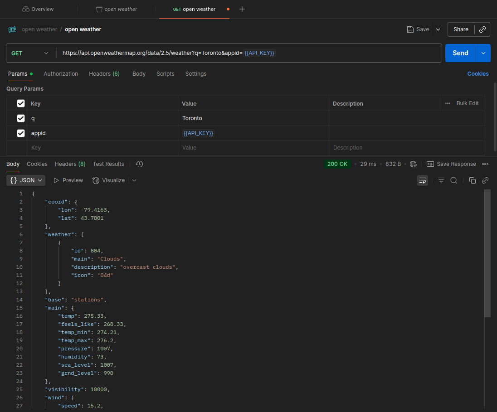
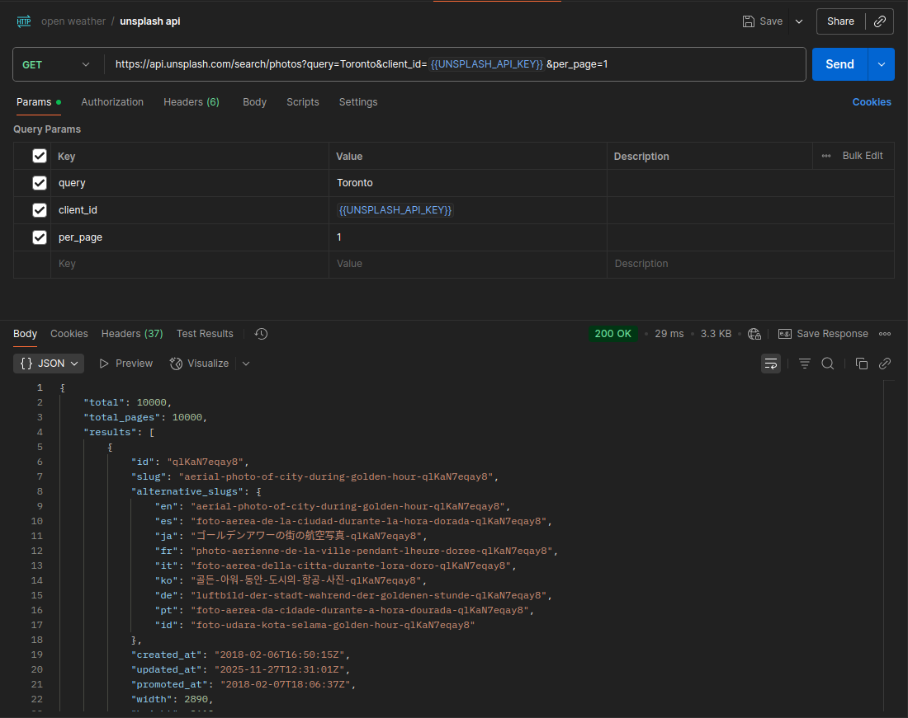
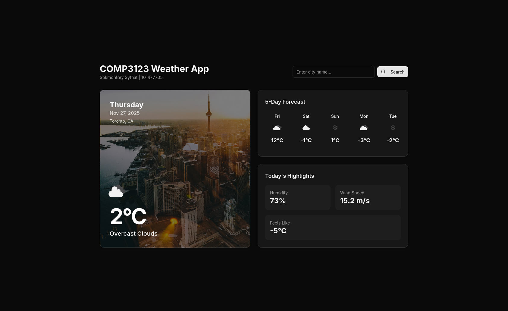
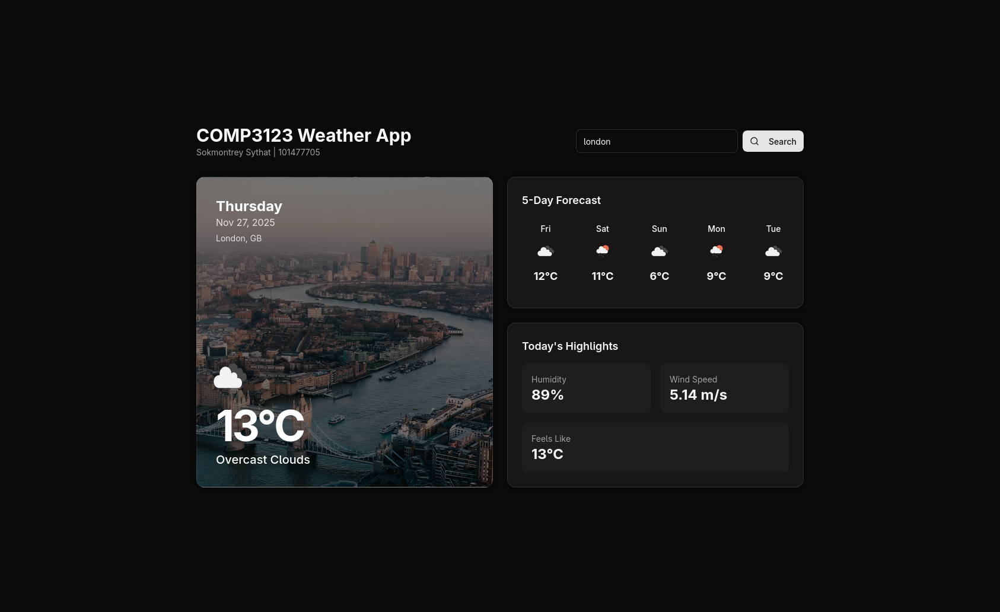

# Weather Application

## Project Description
This project is a React-based weather application built with TypeScript and Vite. It display the current weather conditions and a 5-day forecast for any city. The application also dynamically fetches a background image for the searched city to enhance the user experience.

## Setup Steps

1.  **Clone the repository:**
    ```bash
    git clone https://github.com/SokmontreyGBC/101477705_COMP3123_labtest2.git
    cd 101477705_comp3123_labtest2
    ```

2.  **Install dependencies:**
    ```bash
    npm install
    ```

3.  **Environment Configuration:**
    Create a `.env` file in the root directory and add your API keys:
    ```env
    VITE_WEATHER_API_KEY=your_openweathermap_api_key
    VITE_UNSPLASH_ACCESS_KEY=your_unsplash_access_key (optional)
    ```

4.  **Run the application:**
    ```bash
    npm run dev
    ```

5.  **Build for production:**
    ```bash
    npm run build
    ```

## APIs Used

*   **[OpenWeatherMap API](https://openweathermap.org/api):** Used to fetch current weather data and 5-day forecasts.
    *   Endpoints: `/weather`, `/forecast`
*   **[Unsplash API](https://unsplash.com/developers):** Used to fetch high-quality images of the searched city.
    *   Endpoint: `/search/photos`

## Screenshots

### Postman open weather api

### Postman unsplash api

### Main application page

### Main application page with city search


## Notes & Assumptions

*   **API Keys:** The application assumes that valid API keys for OpenWeatherMap and Unsplash are provided in the `.env` file. Without them, weather data and images will not load.
*   **Styling:** The project uses Tailwind CSS and Shadcn UI for styling.
*   **Browser Support:** Designed for modern browsers.
